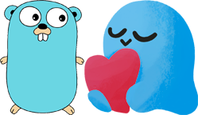

# kajiwoto-clientsdk-golang

## General Info
`kajiwoto-clientsdk-golang` is a golang SDK for interacting with the Kajiwoto Backend. It is basically spawned off
`kajiwoto-dataset-tooling`, because I needed the existing GraphQL functionality, but also additional features
to connect to Kajiwoto's backend services for another project. 

This project contains:
- A Kajiwoto GraphQL client, can be used for basic session functionality and backend interaction.
- A Kajiwoto Websocket client, can be used for chatting with a kaji and trigger events in a chatroom.

#### --- WIP Notice ---
**This project is still in a very rough WIP state.**

Some functionality might be missing, some parts of the implementation might lack documentation or proper structure.
The author of this project aims towards providing a reliable and bug-free codebase.
However, using the code in your own products happens at your own risk!

If you encounter an issue, please create an Issue ticket via Github's issue tracker.
#### --- WIP Notice ---

## USAGE
This is no standalone software; it can be used to integrate Kajiwoto Features into your own products.

### Prequisites
- [Git Client](https://git-scm.com/)
- [Golang 1.19 or higher](https://golang.org/dl/)

## License & Copyright notice
- `kajiwoto-clientsdk-golang` is free software licensed under the [Apache-2.0 License](LICENSE).
- [Kajiwoto](https://kajiwoto.com/) is a platform for creating AI companions. 
The author of `kajiwoto-clientsdk-golang` is in no way aligned with Kajiwoto or paid for his work. 
The sole purpose of `kajiwoto-clientsdk-golang` is to support his own AI development efforts and the Kajiwoto community. 
